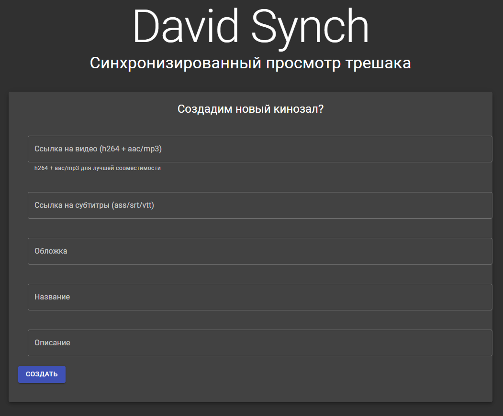

# David Synch

Платформа для совместного просмотра кинца и прочей ереси.




## Архитектура

Архитектура для этой приложухи сворована из моего домашнего проекта (чата), и она очень оверинжинирнута.

Основной замысел — микросервисы на бэкенде.
Имеем набор сервисов, реализующих логику, и роутер, который обеспечивает взаимодействие с клиентами
и сервисов между собой.

Роутер и сервисы общаются через pub/sub Redis'а.
Роутер и клиенты — через WebSockets.

`docker-compose.yml` содержит 5 сервисов:

* mongo — инстанс MongoDB для, очевидно, хранения данных.
* redis — инстанс Redis для организации межпроцессного взаимодействия.
* frontend — фронтенд Синча, внутри сборка фронта и инстанс Nginx'а для хостинга.
* backend-router — роутер бэкенда, обеспечивает взаимодействие фронтенда и бэкендовских сервисов.
* backend-cinema — сервис бэкенда, реализует непосредственно *бизнес-логику*.

## Development

* Copy `./backend/stub.env` to `./backend/.env`.
* Run MongoDB and Redis:
    ```
    docker-compose -f docker-compose.yml -f docker-compose.dev.yml up -d mongo redis
    ```
* Run backend/router:
    ```
    cd backend
    npm run router
    ```
* Run backend/cinema:
    ```
    cd backend
    npm run cinema
    ```
* Run frontend:
    ```
    cd frontend
    npm start
    ```
  
### Note on another reverse-proxy

If you run *yet another* reverse-proxy (like nginx) on top of
this, you might need to configure it to properly handle websocket connections.
For nginx:
```
location /ws.lc/ {
    proxy_pass http://127.0.0.1:80;
    proxy_http_version 1.1;
    proxy_set_header Upgrade $http_upgrade;
    proxy_set_header Connection $connection_upgrade;
}
```

## Deployment

* Set backend configuration in `./backend/.env` (see `./backend/stub.env` and `./backend/.config.js` for reference).
* Set configuration in `./.env` (see `./docker-compose.yml` for reference).
* Run:
    ```
    docker-compose up -d redis mongo
    docker-compose up backend-router
    docker-compose up backend-cinema
    docker-compose up frontend
    ```